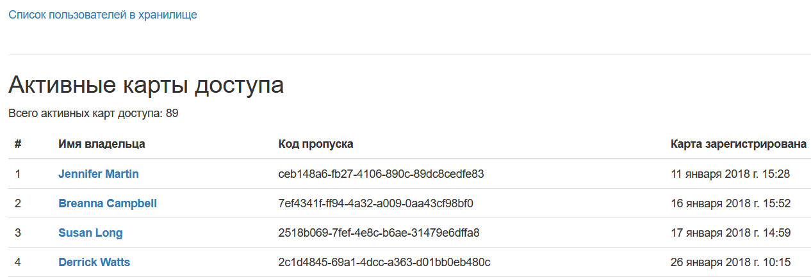
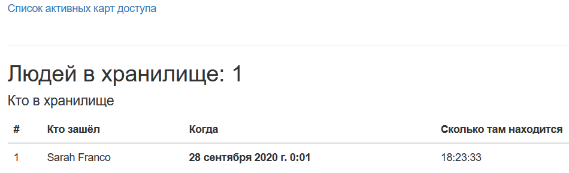
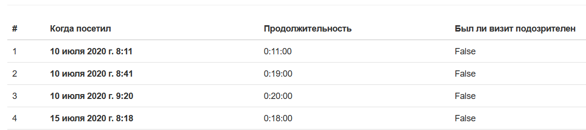

# Пульт охраны банка

Сайт с таблицами пользователй, которые посещали банковское хранилище.

Это внутренний репозиторий для сотрудников банка "Сияние".
Если вы попали в этот репозиторий случайно, то вы не сможете запустить проект,
у вас нет доступа к БД, но вы можете свободно использовать код вёрстки или посмотреть
как реализвоаны запросы к БД.

## Фронт проекта

Фронт взят [отсюда](https://github.com/dvmn-tasks/django-orm-watching-storage).

Список активных карт доступа на главной странице.

На странице `/storage_information` список пользователей, которые прямо сейчас находятся в хранилище.

В любого пользователя можно провалиться и увидеть список его посещений.

## Бэкенд проекта

Запросы к БД для вывода информации выполнены с помощью Django ORM.

## Переменные окружения

Часть переменных в `settings.py` считывается из `.env` с помощью библиотеки `environs`

* `DEBUG` - по умолчанию `False`. Отвечает за DEBUG режим. В `.env` нужно прописать `DEBUG=True` для активации.

* `SECRET_KEY `- по умолчанию `secret_key`. В .env нужно прописать `SECRET_KEY=super_secret_key`

* `ALLOWED_HOSTS` - по умолчанию `127.0.0.1`. Адреса, на которых может запускаться проект.
В .env перечислять через запятую `ALLOWED_HOSTS=127.0.0.1, example.com`

* `DB_URL` - путь к БД. Шаблоны URL в таблице вот [здесь](https://github.com/jacobian/dj-database-url#url-schema).

## Запуск

Команды для запуска

`pip install -r requirements.txt`

`python manage.py runserver`

Перейти на http://127.0.0.1:8000

## Цели проекта

Проект выполнен в учебных целях.

[Devman](https://dvmn.org/modules/). Django ORM. Второй урок.

